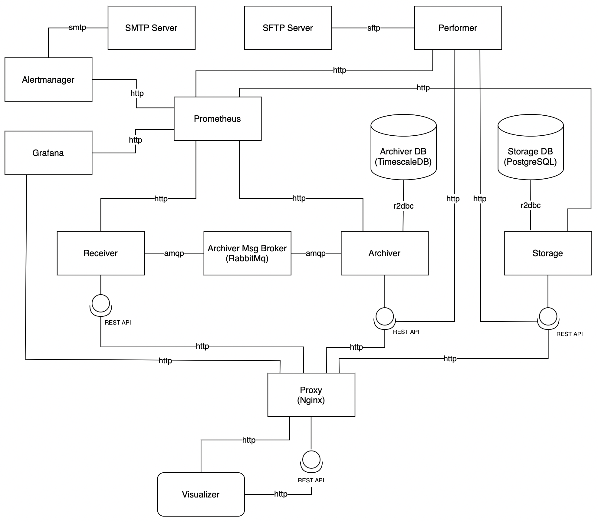
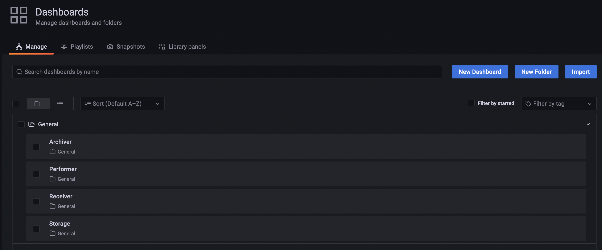
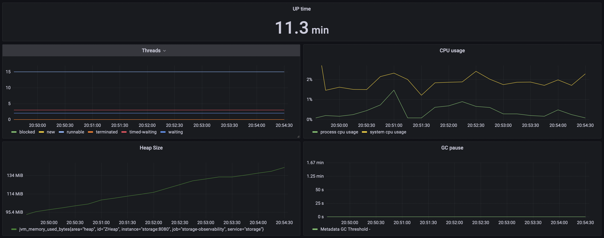
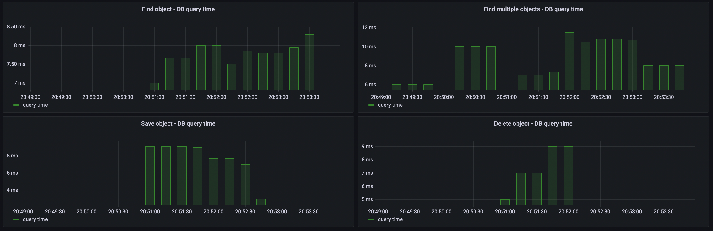
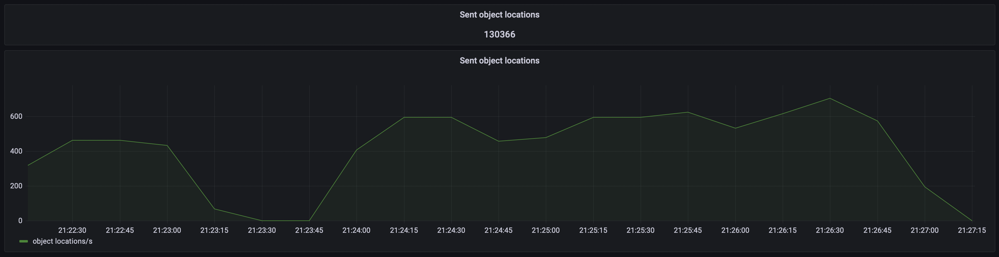
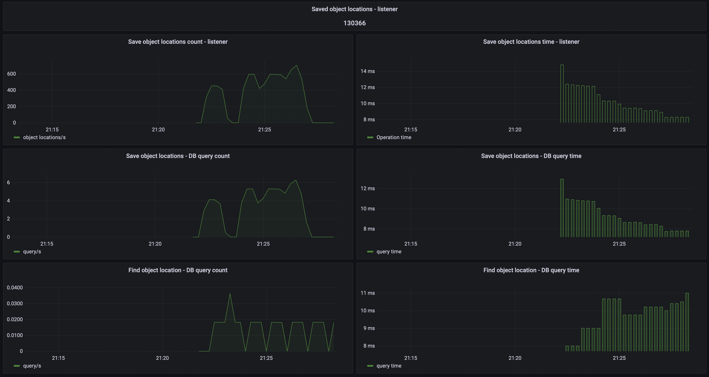
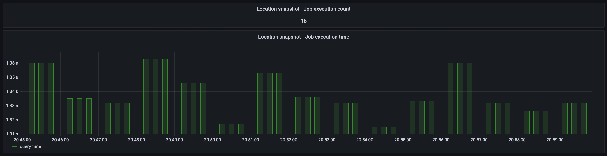

Location Tracker is a system responsible for tracking object locations.

- Creator: Damian Śniatecki (https://www.linkedin.com/in/damiansn/)
- Stage: early development
- Version: 0.0.1

Architecture:

Apps:

- Visualizer - web app responsible for visualizing the location of selected object

Services:

- Storage - service responsible for storing objects data
- Receiver - service responsible for receiving object locations
- Archiver - service responsible for archiving and querying object locations
- Performer - service responsible for executing scheduled jobs

All services are written in a reactive paradigm. It makes them ideal for low-latency, high-throughput workloads.

Receiver sends messages to Archiver via RabbitMq in batches. Archiver receives these batches and saves them in
ArchiverDB using only one query per batch. It allows the system to be resilient and handle high load. Thanks to it, the
system can be also easily scaled horizontally.

Components:

- Visualizer - web app responsible for visualizing the location of selected object
- Storage - service responsible for storing objects data
- Storage Api - OpenAPI definitions for Storage service
- Receiver - service responsible for receiving object locations
- Receiver Api - OpenAPI definitions for Receiver service
- Archiver - service responsible for archiving and querying object locations
- Archiver Api - OpenAPI definitions for Archiver service
- Archiver Msg - Protobuf message definitions for Archiver service
- Performer - service responsible for executing scheduled jobs

Frontend technologies used:

- TypeScript 4.5.2
- Angular 13.2.0

Backend technologies used:

- Kotlin 1.6.0
- JVM 17
- Maven 3.8.4
- Spring Boot 2.6.3 (Webflux)
- Spring Data R2DBC (+ PostgreSQL R2DBC drivers)
- Testcontainers 1.16.0 (+ JUnit, Mockk)
- OpenApi
- RabbitMQ 3.9.8
- PostgreSQL 14
- TimescaleDB 2.6.0 (Based on PostgreSQL 14)
- Prometheus 2.33.3
- Grafana 8.2.6
- Alertmanager 0.23.0
- Nginx 1.21.6
- Docker 20.10.12

Monitoring:

- JVM metrics (For every service)

- Storage metrics

- Receiver metrics

- Archiver metrics

- Performer metrics

Docker Hub:

https://hub.docker.com/u/dsniatecki

- Storage: https://hub.docker.com/r/dsniatecki/storage
- Receiver: https://hub.docker.com/r/dsniatecki/receiver
- Archiver: https://hub.docker.com/r/dsniatecki/archiver
- Performer: https://hub.docker.com/r/dsniatecki/performer

How to start the system:

1. Clone repo
2. Execute: docker-compose -f docker-compose-0.0.1.yml up

Plans:

1. Create webapp with map that would visualise object locations
2. Add Alert Manager
3. Create proper object locations simulator
4. Secure system with keycloak