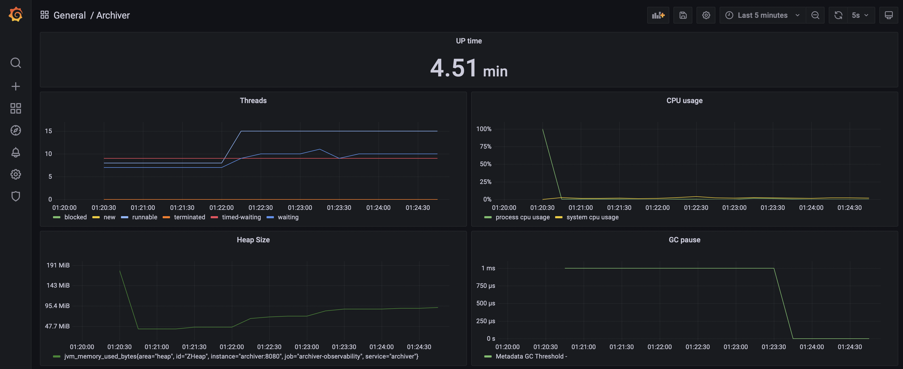
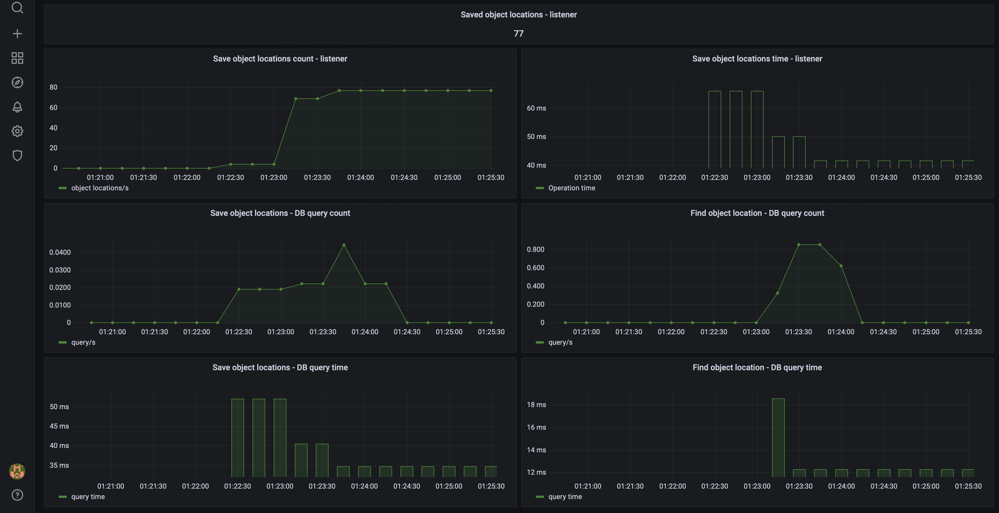

Location Tracker is a system responsible for tracking object locations.

Stage: early development

Components:
- Storage    - service responsible for storing objects data
- Receiver   - service responsible for receiving object locations
- Archiver   - service responsible for archiving and querying object locations
- Performer  - service responsible for executing scheduled jobs

All services are written in a reactive paradigm. It makes them ideal for low-latency, high-throughput workloads.

Receiver sends messages to Archiver via RabbitMq in batches.
Archiver receives these batches and saves them in ArchiverDB using only one query per batch.
It allows the system to be resilient and handle high load.
Thanks to it, the system can be also easily scaled horizontally.

Architecture:

Technologies used:
- Kotlin 1.6.0
- JVM 17
- Spring Boot 2.6.3 ( Webflux )
- Spring Data R2DBC ( + PostgreSQL R2DBC drivers )
- Testcontainers 1.16.0
- RabbitMQ 3.9.8

Monitoring:

