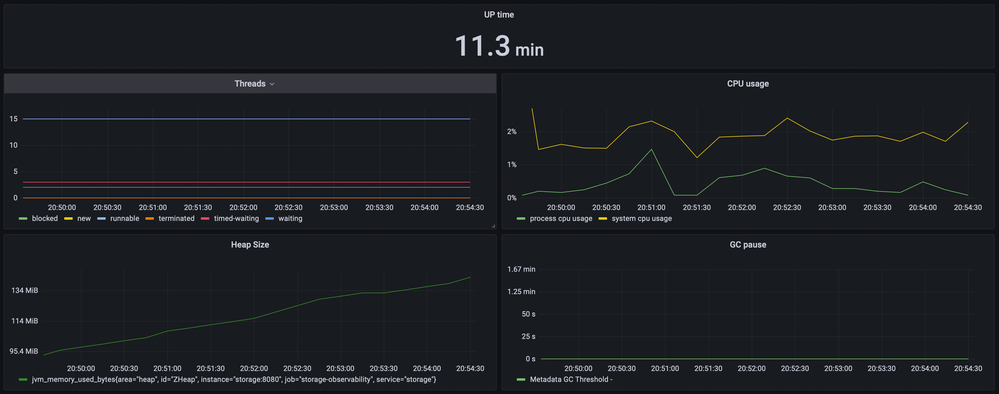
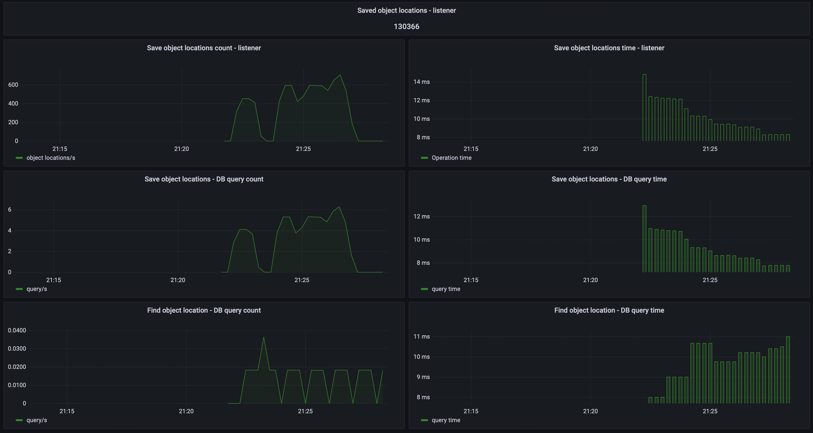

Location Tracker is a system responsible for tracking object locations.

- Creator: Damian Śniatecki (https://www.linkedin.com/in/damiansn/)
- Stage: early development
- Version: 0.0.1

Architecture:

Components:

- Storage - service responsible for storing objects data
- Receiver - service responsible for receiving object locations
- Archiver - service responsible for archiving and querying object locations
- Performer - service responsible for executing scheduled jobs

All services are written in a reactive paradigm. It makes them ideal for low-latency, high-throughput workloads.

Receiver sends messages to Archiver via RabbitMq in batches. Archiver receives these batches and saves them in
ArchiverDB using only one query per batch. It allows the system to be resilient and handle high load. Thanks to it, the
system can be also easily scaled horizontally.

Technologies used:

- Kotlin 1.6.0
- JVM 17
- Spring Boot 2.6.3 (Webflux)
- Spring Data R2DBC (+ PostgreSQL R2DBC drivers)
- Testcontainers 1.16.0 (+ JUnit, Mockk)
- OpenApi
- RabbitMQ 3.9.8
- PostgreSQL 14
- TimescaleDB 2.6.0 (Based on PostgreSQL 14)

Monitoring:

- JVM metrics (For every component)

- Storage metrics

- Receiver metrics

- Archiver metrics

- Performer metrics

Docker Hub:

https://hub.docker.com/u/dsniatecki

- Storage: https://hub.docker.com/r/dsniatecki/storage
- Receiver: https://hub.docker.com/r/dsniatecki/receiver
- Archiver: https://hub.docker.com/r/dsniatecki/archiver
- Performer: https://hub.docker.com/r/dsniatecki/performer

Plans:

1. Create webapp with map that would visualise object locations
2. Add Alert Manager
3. Create proper object locations simulator
4. Secure system with keycloak