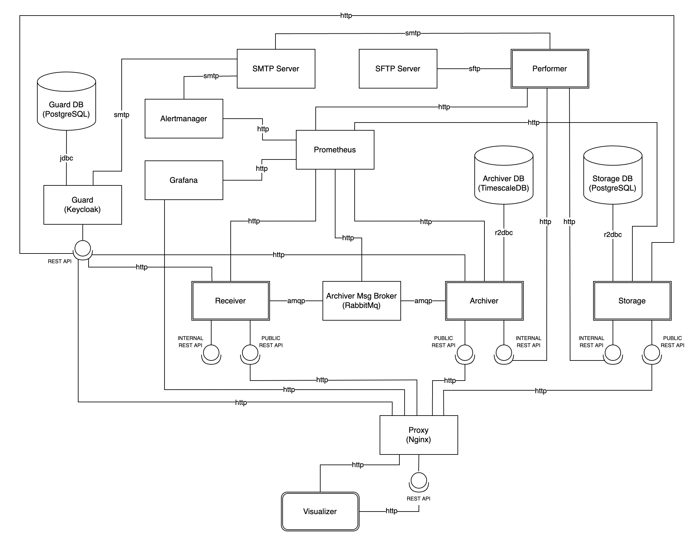

Location Tracker is a system responsible for tracking objects locations.

Components:
- Storage  - Service responsible for storing objects data
- Receiver - service responsible for receiving objects locations
- Archiver - service responsible for archiving and querying objects locations

Architecture:

